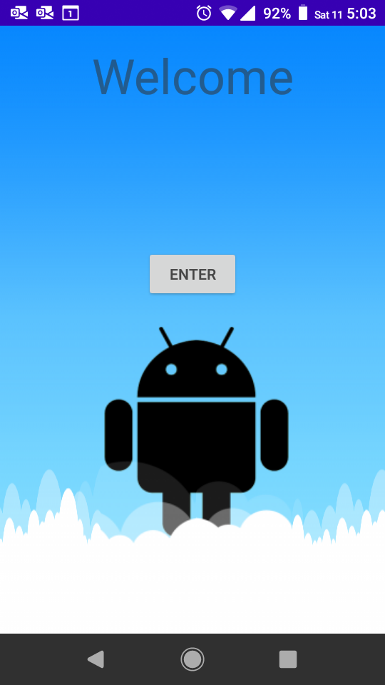
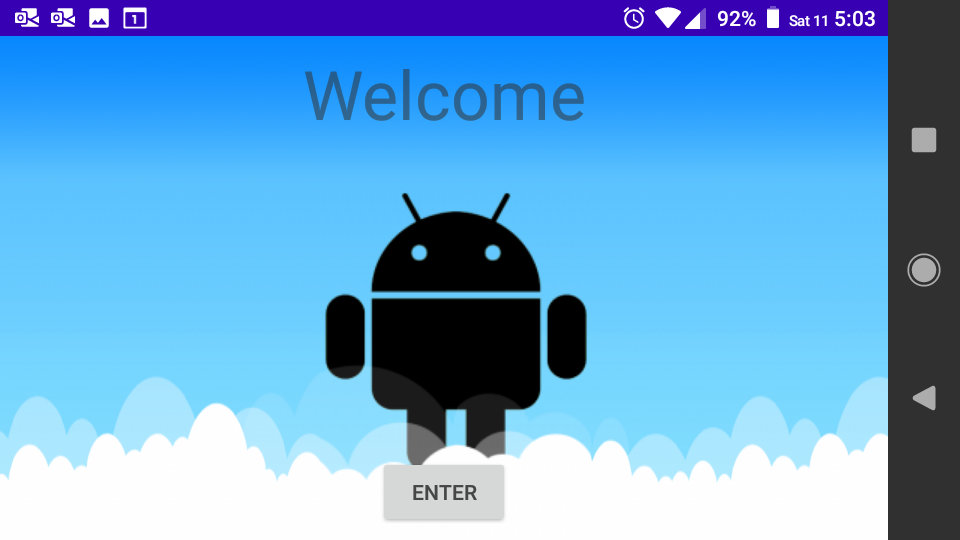
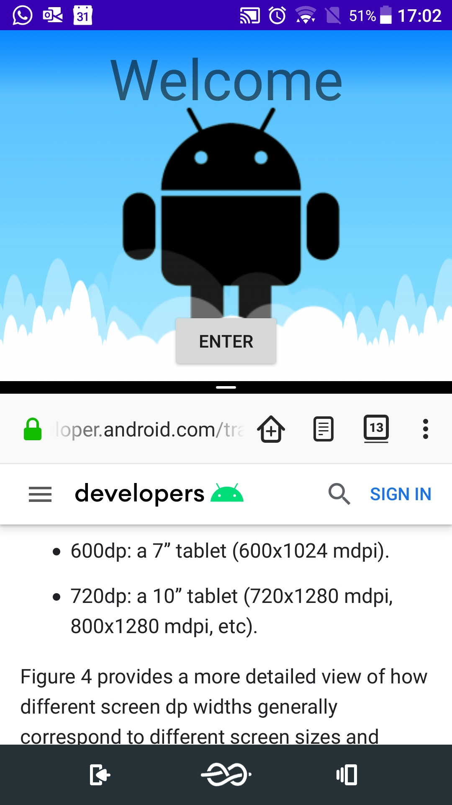
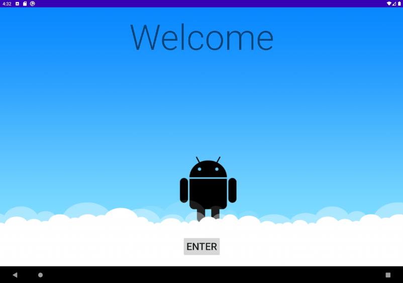

# Android.MiApp
Fundamentos de Android - Coursera
Mi primer proyecto de android

Elaborado por IDBV

Este proyecto consiste de una única actividad cuyo layout esta adaptado para multiples pantallas, 
basandose en la [imagen de muestra](./app/src/main/res/drawable/marcianito_android.9.png) la cual se adapta
usando estructura nine-patch.

## Screenshots

